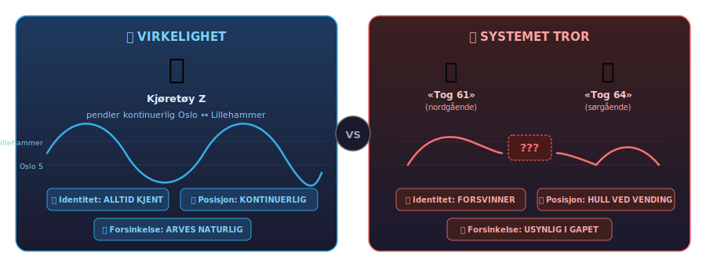

# 🚨 Hvorfor vet ikke appen din hvor toget er?

> *Strukturelle svakheter i sanntidsinformasjon for norsk jernbane.*
> 
> Oslo S – Lillehammer | Mai 2026

---

## 🎯 Kjerneproblemet

En sikkerhetssensor fra **1872** er primærkilden for sanntidsinformasjon til 200 000+ daglige togpassasjerer.

Sensoren måler: *«Kortslutter noe sporkretsen? Ja/nei.»*

Den vet at noe tungt med stålhjul er der. Den vet ikke **hva**, **hvem**, eller **hvor det skal** — fordi det ikke finnes noen kommunikasjonskanal mellom skinne og tog. Kun fysikk: ledningsevne.

Alt annet — identitet, tilhørighet, prediksjon — må **utledes** ved å sammenholde observasjonen med ruteplanen:

> *«Noe er på blokk 42A kl. 14:03 — ifølge planen burde det være tog 61.»*

Stemmer planen, stemmer utledningen. Avviker virkeligheten — kollapser den.

---

## 🔄 To verdener som ikke matcher

### 🚆 Virkeligheten: ett tog, én kontinuerlig bevegelse

Et togsett pendler Oslo S ↔ Lillehammer hele dagen — en uavbrutt, fysisk pendel:



### 📱 Systemet: oppstykket i biter med hull imellom

Kundesystemet ser ikke toget — det ser **separate avganger** adskilt av informasjonshull:



De stiplede linjene er **deadruns** — perioder der toget fysisk eksisterer, men systemet ikke vet hva det gjør.

---

## 🏚️ Problemet i ett bilde



---

## ⚠️ 8 strukturelle svakheter

### 1. 🏷️ Tognummer-forvirringen

Tognummeret har **to motstridende roller**:

| Operasjonelt | Kommersielt |
|---|---|
| Kort, verbalt over radio | Gjenkjennelig i rutetabell |
| Unikt i nettverket til enhver tid | Stabilt over tid |
| Identifiserer en *bevegelse* | Identifiserer en *kundereise* |

Ved vending **må** det operasjonelle nummeret endres — men kunden forholder seg til et annet nummer. Vendingslister forsøker å holde koblingen: *«tog 61 → tog 64»*. Ved avvik kollapser den.

---

### 2. 🧩 Mapping-problemet

For at «sporfelt opptatt» skal bli til «tog 123 er 3 min forsinket til Hamar» trengs en kjede av antagelser:

```
  ⚡ «Noe tungt på blokk 42A»
       │
       │  Hvem er det? 🤷
       ▼
  🗓️  Ruteplanen sier: «tog 61 burde være der nå»
       │
       │  Stemmer det? 🤞
       ▼
  🧮  Beregning: planlagt tid − observert tid = forsinkelse
       │
       │  Holder antagelsene? 🎲
       ▼
  📱  «Tog 61 er 3 min forsinket til Hamar»
```

Hele kjeden hviler på at **planen stemmer med virkeligheten**. Feiler ved: avvik, ekstraavganger, innstillinger, togbytte, eller deadrun der ingen kundereise finnes å matche mot.

---

### 3. 🕳️ Deadrun-hullet

Når toget ankommer Lillehammer og vender:

```
  ServiceJourney 456 (nordgående)
       │
       ▼  ANKOMST
  ═══════════════════════════════  ← Informasjon STOPPER
       
       ⏳ Vending, førerbytte, klargjøring
       
  ═══════════════════════════════  ← Informasjon STARTER (for sent)
       │
       ▼  AVGANG
  ServiceJourney 789 (sørgående)
```

Kunden som venter på avgang 789 har **null informasjon** i dette gapet — til tross for at toget fysisk er 50 meter unna.

---

### 4. 📉 Usynlig forsinkelsesarv

En forsinkelse dør ikke — den **arves**:

```
  Tog 61 ankommer Lillehammer: +8 min forsinket
  Planlagt vendingstid:         12 min
  Buffer igjen:                 4 min
  
  Tog 64 (neste avgang):       Viser "i rute" ← FEIL
                                (burde vise "redusert margin"
                                 eller "+4 min" om vending tar normaltid)
```

Kunden ser «i rute» helt til avgang 789 formelt starter — selv om forsinkelsen allerede er et faktum. Prediksjonen er **umulig** uten å vite at det er samme kjøretøy.

---

### 5. 👁️ Sensoren ser stål — ikke reisen

| Infrastruktur-sensoren vet | Kunden trenger å vite |
|---|---|
| Sporfelt opptatt/ledig | Hvilken avgang er det? |
| Noe passerte punkt X kl. Y | Er toget mitt forsinket? |
| Aksler telt | Når er jeg fremme? |
| Sporveksel i posisjon | Hvilken plattform? |

Oversettelsen mellom disse to verdenene krever **topologisk mapping** + **ruteplankobling** — begge er konstante feilkilder.

---

### 6. 💀 Single point of failure — «signalfeil»

Sporfeltet er sikkerhetssystemet. Feiler det, går signalet i stopp — ingen tog kan passere. Dette er det reisende kjenner som **«signalfeil»**.

```
  Sporfelt feiler
       │
       ├──► 🚦 Signal → STOPP (sikkerhet: ingen tog passerer)
       │
       └──► 📱 Sanntid → ??? (info-kilden er DEN SAMME som feilet)
```

Ironien: **systemet som skulle fortelle deg hvor toget er, er det samme systemet som stoppet det.** Når kunden trenger informasjon mest (alt står) — er informasjonskilden den som er nede.

Med en uavhengig kilde (GPS ombord) ville toget fortsatt rapportere: *«Jeg står mellom Stange og Hamar, har stått i 12 min»* — selv når sporfeltet er dødt.

---

### 7. ⏱️ Latens i informasjonskjeden

Fra hendelse til app — **6+ ledd**, hvert med forsinkelse og feilmulighet:

```
  ⚡ Sporfelt            → Signalanlegg
  → Trafikkstyringssentral  → Matching/mapping
  → Sanntidssystem          → SIRI-feed
  → Reiseplanlegger         → 📱 Kunde
  
  ⏱️ Total latens: sekunder → minutter
  🎯 Feilmuligheter: hvert ledd
```

---

### 8. 🔀 Linjebrudd = informasjonskaos

Ved brudd splittes én elegant pendel i et lappeteppe av fragmenter:

```
  NORMALT:     🚆━━━━━━━━━━━━━━━━━━━━━━━━━━━━🚆
               Oslo S                    Lillehammer
               [────── 1 tog, 1 historie ──────]


  VED BRUDD:   🚆━━━━━━━╋╋╋╋╋╋╋╋╋╋━━━━━━━🚆
               Oslo S    💥 BRUDD     Lillehammer
                         (Hamar)
               
               🚆══════╸ 🚌🚌🚌 ╺══════🚆
               [tog A]   [buss]    [tog B]
               
  Kunden:      «Hva skjer? Hvor er bussen? 
                Rekker jeg toget på andre siden?» 🤷
```

- 📋 Vendingslister? Irrelevante — endepunktene er nye og improviserte
- 🧩 Mapping? Må bygges fra scratch i en kaotisk situasjon
- 🔗 Korrespondanse tog → buss → tog? **Usynlig** for kunden
- 🚃 Materiellkjennskap? Null — er det samme togsett som pendler?
- ⏱️ Sanntid for bussen? Ofte: *finnes ikke*

---

## 📊 Konsekvenser for reisende

| Situasjon | Hva kunden opplever |
|-----------|-------------------|
| Vending på Lillehammer | ❓ Ingen info. «Er toget i rute?» — ukjent. |
| Forsinkelse propagerer | 😠 Plutselig +8 min ved avgang — uten forvarsel |
| Sensorfeil | 💀 Sanntid forsvinner helt — «Ingen data» |
| Linjebrudd | 🤷 Fragmentert info, uklar korrespondanse |
| Togbytte | 👻 Identitetsbrudd — toget «forsvinner» fra systemet |

---

## 🤔 Hvorfor er det slik?

Det er ikke et bevisst arkitekturvalg — det er **historisk arv**.

Track circuits ble oppfunnet i 1872 av William Robinson for å besvare ett binært sikkerhetsspørsmål: *«Er blokken fri?»* De ble lovpålagt etter Armagh-ulykken (1889) og er grunnlaget for automatisk blokksignalering verden over.

Da man senere ønsket sanntidsinformasjon til reisende, var sporfelter den **eneste tilgjengelige kilden med nasjonal dekning**. Sikkerhetssensoren ble gjenbrukt som sanntidssensor — uten at den var designet for det.

| Designet for (sikkerhet) | Brukt til (sanntid) |
|---|---|
| Er blokken fri? (ja/nei) | Hvor er toget? (posisjon) |
| Anonym (noe er der) | Identifisert (tog 61 passerte) |
| Binær per blokk | Kontinuerlig sporing |
| Fungerer uten ruteplan | Krever ruteplan for å gi mening |

Vi driver sanntidsinformasjon i 2026 på en sensor designet for blokkbeskyttelse i 1872.

---

## 📚 Kilder og referanser

### Sporkrets / Track circuit

| Påstand | Kilde |
|---------|-------|
| Oppfunnet av William Robinson i 1872 | American Railway Association (1922). *[The Invention of the Track Circuit](https://archive.org/details/inventionoftrack00newyrich)*. New York: ARA. Primærkilde — jubileumsskrift med patenthistorikk. |
| Første bruk (ikke-failsafe) av W.R. Sykes, 1864 | Marshall, J. (1978). *A biographical dictionary of railway engineers*. David & Charles. p. 162. |
| Deteksjonsmekanisme: «noe i sporet» → rødt signal | Bane NOR. [«Hva er signalfeil?»](https://www.banenor.no/nyheter-og-aktuelt/bane-nor-forklarer/signalfeil/) — *«Signaler forteller oss om det er tog ute i sporet. Av og til blir systemet lurt og tror det går trafikk på skinnene, uten at det stemmer.»* |
| «Spøkelsestog»: spon over skjøt kortslutter sporfeltet | Ibid. *«Det kan skyldes spon fra skinnegangen som virvles opp når tog bremser, og som legger seg over en skjøt mellom skinnene. Systemet får da signaler om at det er noe i sporet og feiltolker det som tog.»* |

### Armagh-ulykken og lovpålagt blokkbeskyttelse

| Påstand | Kilde |
|---------|-------|
| Armagh-ulykken 12. juni 1889 | Maj-Gen C.S. Hutchinson. *[Report into the collision near Armagh](http://www.railwaysarchive.co.uk/documents/BoT_Armagh1889.pdf)*, Board of Trade, 1889. Primærkilde. |
| Førte til Regulation of Railways Act 1889 | *[Regulation of Railways Act 1889](https://www.legislation.gov.uk/ukpga/Vict/52-53/57/contents)*, c. 57. UK Parliament. Lovpåla automatisk brems, blokkering og forrigling. |

### ERTMS/ETCS i Norge

| Påstand | Kilde |
|---------|-------|
| Regjeringsbeslutning om ERTMS (2012) | Samferdselsdepartementet. [«ERTMS – orientering om regjeringens beslutning»](https://www.regjeringen.no/globalassets/upload/sd/vedlegg/jernbane/ertms_jbv.pdf), 2012. |
| Østfoldbanens østre linje: første ETCS i Norge (2015) | Bane NOR. [«Fortellingen om jernbanen som måtte bli digital»](https://www.banenor.no/prosjekter/alle-prosjekter/ertms-fremtidens-signalsystem/aktuelt-om-ertms/fortellingen-om-jernbanen-som-matte-bli-digital/) — *«I 2015 tok vi i bruk ERTMS på Østfoldbanens østre linje.»* |
| Gjøvikbanen: ERTMS november 2024 | Ibid. *«I november 2024 fikk Gjøvikbanen også ERTMS, på strekningen mellom Roa og Gjøvik.»* |
| Utrulling forsinket: alle tre leverandører melder forsinkelser | Bane NOR. [«Usikker fremdrift for nytt signalsystem»](https://www.banenor.no/prosjekter/alle-prosjekter/ertms-fremtidens-signalsystem/aktuelt-om-ertms/usikker-framdrift-for-nytt-signalsystem/) |
| Signalanlegg fra 1950-tallet, Oslo S fra 1977 | Bane NOR (ibid. «Fortellingen…»). *«De eldste av disse er fra starten av 1950-tallet»*, *«Oslo S: signalanlegget fra 1977»*. |

### Sikringsanlegg og togdeteksjon

| Påstand | Kilde |
|---------|-------|
| Sikringsanlegget overvåker infrastrukturens sikkerhet | Bane NOR. [«Hva er signalfeil?»](https://www.banenor.no/nyheter-og-aktuelt/bane-nor-forklarer/signalfeil/) — *«Vi har et system som kalles sikringsanlegg på jernbanen. Det overvåker alle deler av infrastrukturen som har med sikkerheten å gjøre.»* |
| Feil → rødt signal → all trafikk stanses | Ibid. *«Hvis sikringsanlegget oppdager feil på enkelte komponenter, fører det til at signalanlegget gir togene rødt lys.»* |
| 75 % av togtrafikk via Oslo S → nasjonal sårbarhet | Ibid. *«Nesten 75 prosent av all togtrafikk i Norge går innom Oslo S. Feil i dette området påvirker over 80 prosent av togtrafikken nasjonalt.»* |

### SIRI-standard (nordisk profil)

| Påstand | Kilde |
|---------|-------|
| SIRI (Service Interface for Real Time Information) | CEN/TS 15531-1:2006 t.o.m. CEN/TS 15531-5:2006. Europeisk standard for sanntidsinformasjon i kollektivtransport. |
| Nordisk profil for SIRI ET og VM (versjon 1.0, 1.1) | Entur. [Nordic SIRI Profile](https://entur.atlassian.net/wiki/spaces/PUBLIC/pages/637370420/SIRI) — profildokumenter for [SIRI-ET](https://entur.atlassian.net/wiki/spaces/PUBLIC/pages/637370392/SIRI-ET) og [SIRI-VM](https://entur.atlassian.net/wiki/spaces/PUBLIC/pages/637370425/SIRI-VM). |
| Krav om sanntidsleveranse | Jernbanedirektoratet. *Håndbok for bestilling av persontransport med tog*, vedlegg om sanntidsinformasjon. |

### Sensorutstyr ombord

| Påstand | Kilde |
|---------|-------|
| WiFi-router med GPS på togsett | Norske Tog / Vy: Flåtespesifikasjoner for BM74/BM75/BM76. Icomera/Nomad Digital WiFi-systemer med integrert GPS. |
| Odometer på alle togsett | Standard jernbaneutstyr. Brukes bl.a. for ETCS-posisjonering (jf. ERTMS/ETCS System Requirements Specification, SUBSET-026 §4.3.1 «Odometry»). |
| GPS i sikringsskap | Nyere materiell (Flirt, Flirt Akku) har dedikerte GPS-moduler. Stadler Rail AG, flåtespesifikasjoner. |

---

> **Merk:** Kilder merket med direkte sitat er offentlig tilgjengelige. For Jernbanedirektoratets Håndbok og flåtespesifikasjoner fra Norske Tog/Stadler henvises det til aktørenes egne arkiver.

---

*📎 Løsningsforslag: se [sammenstilling.md](sammenstilling.md)*
