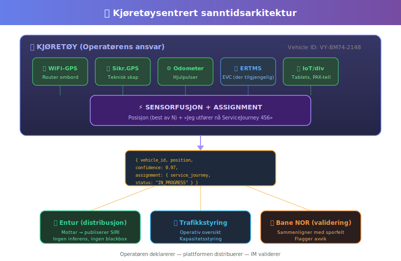

# 🚆 Sanntid på skinner — hvorfor vet ikke appen din hvor toget er?

> *En analyse av strukturelle svakheter i norsk jernbane-sanntid, med forslag til løsning.*
> 
> Strekning: **Oslo S – Lillehammer** | Mai 2026

---

## 🎯 TL;DR

Norsk jernbane bruker en **sikkerhetssensor fra 1872** som primærkilde for sanntidsinformasjon til reisende. Sensoren måler én ting: *kortslutter noe sporkretsen akkurat nå — ja eller nei?* Den vet at noe tungt med stålhjul er der. Den vet ikke **hva**, **hvem**, eller **hvor det skal** — fordi det ikke finnes noen kommunikasjonskanal mellom skinne og tog. Kun fysikk: ledningsevne.

Resultatet: sensoren *måler* presist — men identitet, tilhørighet og prediksjon må **utledes** ved å sammenholde observasjonen med ruteplanen. *«Noe er på blokk 42A kl. 14:03 — ifølge planen burde det være tog 61.»* Stemmer planen, stemmer utledningen. Avviker virkeligheten — kollapser den.

---

## 🔄 Virkeligheten vs. modellen

### Toget: én kontinuerlig bevegelse

Et togsett pendler Oslo S ↔ Lillehammer hele dagen — en uavbrutt, fysisk sinuskurve:


### Systemet: oppstykket i biter

Kundesystemet ser ikke toget — det ser **separate avganger** med hull imellom:


De stiplede linjene (deadruns) er **informasjonshull** — perioder der toget fysisk eksisterer, men systemet ikke vet hva det gjør.

---

## 🏚️ Problemet i ett bilde


---

## ⚠️ 8 svakheter — kort oppsummert

| # | Svakhet | Konsekvens |
|---|---------|-----------|
| 1 | 🏷️ **Tognummer-forvirring** | Operasjonelt ID ≠ kunde-ID. Identitetsbrudd ved vending. |
| 2 | 🧩 **Mapping-problemet** | Anonym sensorhendelse → kundereise krever skjør kobling. |
| 3 | 🕳️ **Deadrun-hullet** | Null sanntid ved vendestasjon — der kunden trenger det mest. |
| 4 | 📉 **Usynlig forsinkelsesarv** | +8 min inn → ??? ut. Kunden vet ingenting før ny avgang starter. |
| 5 | 👁️ **Sensor ser stål, ikke reise** | Infrastruktur ≠ tjeneste. Krever konstant «oversettelse». |
| 6 | 💀 **Single point of failure** | Én sensorkilde. Feil = blackout. |
| 7 | ⏱️ **Latens i kjeden** | 6+ ledd mellom hendelse og app-oppdatering. |
| 8 | 🔀 **Linjebrudd = kaos** | Én pendel → mange fragmenter. Mappingen kollapser. |

---

## 💡 Løsningen: Spor kjøretøyet, ikke avgangen

### Prinsipp

> *Ikke spør «hvor er tog 61?» — spør «hva gjør kjøretøy Z akkurat nå?»*

### Sensorkilder som finnes OM BORD — i dag

| Kilde | Status | Kommentar |
|-------|--------|-----------|
| 📡 WiFi-router GPS | ✅ Installert | Allerede på de fleste togsett |
| 🛰️ GPS i sikringsskap | ✅ Installert | Nyere materiell |
| ⚙️ Odometer | ✅ Installert | Alle togsett |
| 🔐 ERTMS/EVC | ⏳ Delvis | Kun Østfoldbanen. Kronisk forsinket. |
| 📱 IoT-enheter | ✅ Varierer | Tablets, diagnostikk, PAX-telling |

**Du trenger ikke vente på ERTMS.** Hardwaren er der allerede.

---

## 🏗️ Foreslått arkitektur



### Meldingsformat — operatøren deklarerer

```json
{
  "vehicle_id": "VY-BM74-2148",
  "position": { "lat": 60.793, "lon": 11.068 },
  "confidence": 0.97,
  "timestamp": "2026-05-19T14:32:01Z",
  "assignment": {
    "service_journey": "VYT:ServiceJourney:456",
    "status": "IN_PROGRESS",
    "next_stop": "NSR:Quay:0342"
  }
}
```

Ved vending:
```json
{
  "vehicle_id": "VY-BM74-2148",
  "position": { "lat": 61.115, "lon": 10.466 },
  "confidence": 0.95,
  "assignment": {
    "status": "DEADRUN",
    "next_journey": "VYT:ServiceJourney:789",
    "next_departure": "2026-05-19T15:05:00Z"
  }
}
```

👆 Kunden ser: *«Toget er på Lillehammer, neste avgang 15:05»* — ikke et sort hull.

### Utledning til kundestrømmer: VM vs. ET

Sanntidskilden er kjøretøysentrert og kontinuerlig — men det som eksponeres mot kunde er **to separate SIRI-strømmer** med forskjellig cutoff-logikk:

| Strøm | Innhold | Under deadrun |
|-------|---------|---------------|
| **SIRI VM** | Kjøretøyets posisjon i sanntid | ❌ **Kuttes** — kunden trenger ikke se toget stå stille på vendestasjon |
| **SIRI ET** | Estimert avgang/ankomst for kundereiser | ✅ **Beholdes** — arvet forsinkelse propageres til neste ServiceJourney |

```
  Kjøretøy Z: kontinuerlig sporing (intern)
       │
       ├──► SIRI VM: "Tog 61 er ved Brumunddal" 
       │         (aktiv kun under ServiceJourney)
       │
       └──► SIRI ET: "Avgang 789 kl. 15:05 → estimert 15:09 (+4 min)"
                 (oppdateres SELV under deadrun — fordi arving er kjent)
```

**Resultatet:** Kunden på Lillehammer som venter på avgang 789 ser:
- VM: ingenting (toget er i vending — irrelevant)  
- ET: *«Estimert avgang 15:09, +4 min forsinket»* — fordi systemet vet at kjøretøyet ankom 8 min sent og vendingstiden er 12 min

---

## 🎭 Ansvarsmodell — ingen blackbox

| Aktør | Rolle | Analogi |
|-------|-------|---------|
| 🚃 **Operatør** | Sensorfusjon + deklarerer assignment | Flyselskapet melder «dette flyet er SK4455» |
| 📢 **Entur** | Mottar og distribuerer (SIRI) | Avinor videreformidler avgangstider |
| 🛤️ **Bane NOR** | Sikkerhet/signalering (sporfelter forblir sikkerhetssystem) | Deres jobb er uendret — blokkbeskyttelse |
| 📋 **Jernbanedir.** | Kravstiller format via trafikkavtaler | Luftfartstilsynet pålegger AIS/transponder |

Infrastruktursensorene beholder sin rolle: **sikkerhet**. De er ikke «validatorer» av kundeinfo — de forhindrer kollisjoner. At de *kan* brukes som kryssreferanse er en bonus, ikke et krav.

**Ingen gjetting. Ingen inferens. Operatøren *vet* — og sier fra.**

---

## 🆚 Før og etter

| | 🏚️ I dag | 🚀 Foreslått |
|---|----------|-------------|
| **Primærkilde** | Sporfelt (1872-teknologi) | Kjøretøy-GPS + fusjon |
| **Identitet** | Anonym → gjettet | Deklarert av operatør |
| **Posisjon** | Diskrete blokker | Kontinuerlig lat/lon |
| **Ved vending** | ❌ Sort hull | ✅ Eksplisitt DEADRUN-status |
| **Forsinkelsesarv** | Usynlig | Beregnes umiddelbart |
| **Redundans** | Single point of failure | N kilder, graceful degradation |
| **Linjebrudd** | Mapping kollapser | Kjøretøy rapporterer uansett |
| **Latens** | 6+ ledd | Direkte fra kjøretøy |
| **ERTMS-avhengig** | — | Nei (bonus når det kommer) |

---

## 🚦 Hva kreves?

```
┌─────────────────────────────────────────────────────────────┐
│                                                             │
│  ✅ Nordisk profil for SIRI ET/VM         — FINNES         │
│  ✅ Krav om leveranse (Håndboken)         — FINNES         │
│  ✅ GPS/sensorer ombord                   — FINNES         │
│  ✅ Standardformat for meldinger          — FINNES         │
│                                                             │
│  ❌ Erkjennelse av at inndata er          — MANGLER        │
│     utilstrekkelig / upålitelig                             │
│                                                             │
│  ❌ Krav om å benytte alternative         — MANGLER        │
│     kilder fra kjøretøyet                                  │
│                                                             │
└─────────────────────────────────────────────────────────────┘
```

**Standarden finnes. Profilene finnes. Kravet finnes. Hardwaren finnes.**

Problemet er at alle aksepterer sporfeltet som «godt nok» — uten å stille spørsmål ved om grunnlaget for VM/ET faktisk er pålitelig. Ingen har sagt: *«dataen som mates inn er for dårlig — bruk det som allerede sitter på toget.»*

Det trengs ikke et standardiseringsprosjekt. Det trengs en erkjennelse.

---

## 🧭 Oppsummering

Det tekniske er løst. WiFi-routeren har GPS. Odometeret teller hjulomdreininger. Sikringsskapet har sin egen posisjonsenhet. Alt som trengs er:

1. **En standard** — hva skal meldingen inneholde?
2. **Et krav** — operatøren *skal* levere feeden
3. **En mottaker** — plattformen distribuerer uten magi

Toget vet allerede hvor det er. Vi trenger bare å *spørre*.

---

*📎 Bakgrunnsdokumentasjon: [sanntidsanalyse_svakheter.md](sanntidsanalyse_svakheter.md)*
